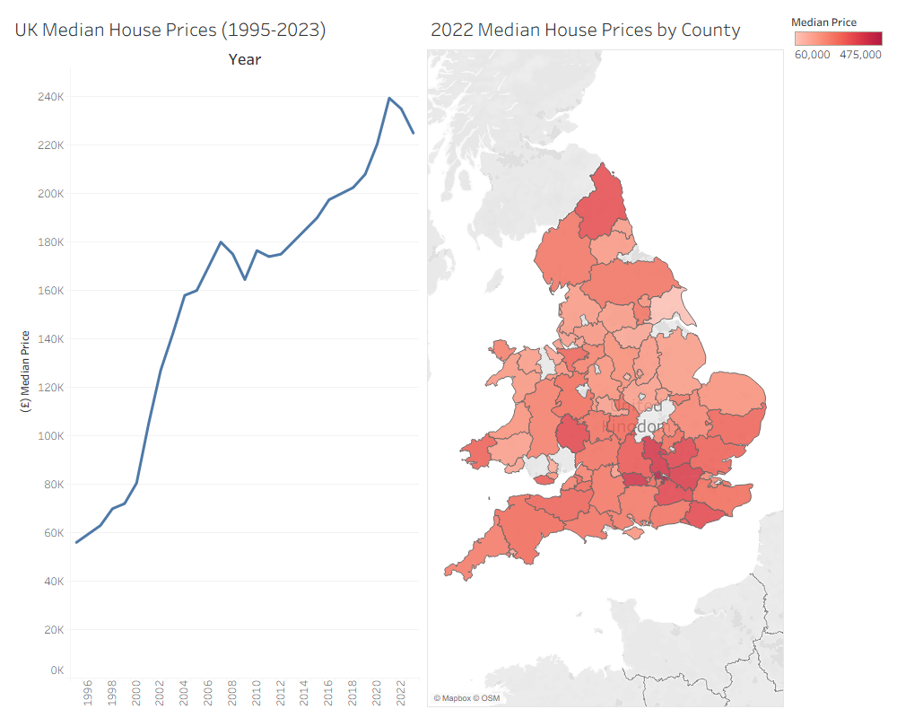

# UK Housing Market Analysis
## Objective
A time-series analysis of UK median house prices to identify impacts of key events on housing costs over the last four decades, and examine counties and their median house prices in 2022 to determine areas with high cost of living.
## Dataset
UK Housing (Cleaned) dataset sourced from Kaggle
**Note:** The original dataset contains records for year 2023 which is to be excluded in the analysis due to insufficient record count relative to the rest of the years
## Methodology
- Imported large-scale dataset into MySQL using Python (Pandas + SQLAlchemy) due to record size limitations of standard import wizard
- Calculated Median house prices to avoid skewed averages caused by outliers (eg. very few high End properties)
- Calculated Median house prices by county for most recent year in the dataset - 2022.
- Excluded counties with 30 or fewer records due to insufficient sample size
- Visualised results using line graph and heatmap in Tableau
## Key Findings
- Exponential housing inflation from 2000-2007
- Median house prices ranged from £164k to £175k for 4 years after the 2008 financial crash
- Median record high of £240k in 2021 caused by several factors: the rise of hybrid/remote work triggered by COVID-19, Stamp duty holiday & low interest rates
- Top 5 counties with highest median house prices: (Windsor, West Berkshire, Buckinghamshire, Greater London, Hertfordshire)
## Files
- `uk_median_house_prices.sql` – SQL query used for analysis
- `uk_median_house_prices.png` – Visualisation of results
## Output

